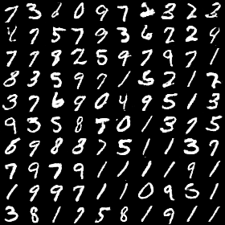

## KERAS-DCGAN ##

Implementation of http://arxiv.org/abs/1511.06434 with the (awesome) [keras](https://github.com/fchollet/keras) library, for generating artificial images with deep learning.



This trains two adversarial deep learning models on real images, in order to produce artificial images that look real.



The generator model tries to produce images that look real and get a high score from the discriminator.



The discriminator model tries to tell apart between real images and artificial images from the generator.


---

This assumes theano ordering.
You can still use this with tensorflow, by setting "image_dim_ordering": "th" in ~/.keras/keras.json (although this will be slower).

---

## Usage


**Training:**

 `python dcgan.py --mode train --batch_size <batch_size>`



  python dcgan.py --mode train --path ~/images --batch_size 128



**Image generation:**

`python dcgan.py --mode generate --batch_size <batch_size>`



`python dcgan.py --mode generate --batch_size <batch_size> --nice` : top 5% images according to discriminator



python dcgan.py --mode generate --batch_size 128


---


## Result



**generated images :** 















**train process :**









---
