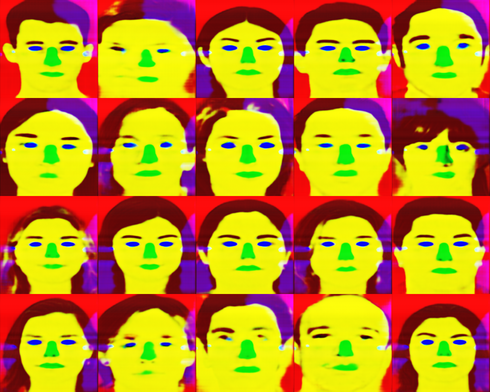

## KERAS-CONDITIONAL GAN ##

Implementation of conditional GAN https://arxiv.org/abs/1411.1784 with [keras](https://github.com/fchollet/keras).

Implements the improvements and architecture of https://arxiv.org/pdf/1611.07004v1.pdf.

Code borrows from the Keras non-conditional GAN https://github.com/jacobgil/keras-dcgan and the Torch conditional GAN https://github.com/ppwwyyxx/tensorpack/blob/master/examples/GAN/Image2Image.py.

---

This assumes theano ordering.

---

## Usage


**Training:**

 `KERAS_BACKEND=theano THEANO_FLAGS=optimizer=fast_compile,device=cuda0,floatX=float32 ./conditional_gan.py --data train`



  KERAS_BACKEND=theano THEANO_FLAGS=optimizer=fast_compile,device=cuda0,floatX=float32 ./conditional_gan.py --data train



**Image generation:**

 `KERAS_BACKEND=theano THEANO_FLAGS=optimizer=fast_compile,device=cuda0,floatX=float32 ./conditional_gan.py --data test`



  KERAS_BACKEND=theano THEANO_FLAGS=optimizer=fast_compile,device=cuda0,floatX=float32 ./conditional_gan.py --data test


---


## Result



**(conditioned) generated images :** 







**train process :**










---
